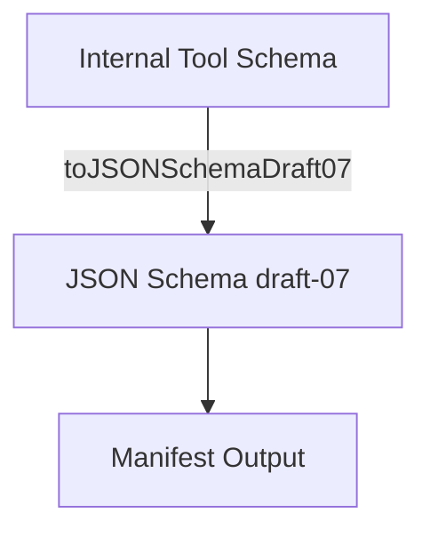

# [4-2] Build schema transformation service

[Back to task list](./tasks.md)

## Description
Create a service that converts internal tool schemas (used in the tool registry) to valid JSON Schema draft-07 format for inclusion in the tool manifest. This enables dynamic, standards-compliant manifest generation for LLM agents and other consumers.

## Status History
| Timestamp           | Event Type     | From Status | To Status | Details                                                      | User     |
|---------------------|---------------|-------------|-----------|--------------------------------------------------------------|----------|
| 2025-06-18 23:57:00 | Created       | N/A         | Proposed  | Task file created                                            | AI_Agent |
| 2025-06-18 23:58:00 | Status Update | Proposed | Agreed | User approved task definition and moved to Agreed. | chaddorsey |
| 2025-06-18 23:59:00 | Status Update | Agreed | InProgress | Started implementation of schema transformation service. | AI_Agent |
| 2024-06-19 00:30:00 | Status Update | InProgress | InProgress | Began implementation of schema transformation service in src/services/browserWorker/utils/schemaTransform.ts and test in src/test/services/browserWorker/schemaTransform.test.ts | AI_Agent |
| 2024-06-19 00:45:00 | Status Update | InProgress | Review | Implementation and tests complete. Task ready for review. | AI_Agent |
| 2024-06-19 01:00:00 | Status Update | Review | Done | Task reviewed and approved by user. Marked as Done. | chaddorsey |

## Requirements
### Functional Requirements
1. Accept internal tool schema definitions as input (TypeScript objects or similar).
2. Output valid JSON Schema draft-07 objects for each tool.
3. Support all property types used in the tool registry (string, number, boolean, array, enum, object, etc.).
4. Handle required/optional fields and nested structures.
5. Be easily extensible for future schema changes.
6. Include unit tests for key transformation scenarios.

### Non-Functional Requirements
- Code must be well-documented and maintainable.
- Should not introduce breaking changes to existing endpoints.

## Implementation Plan

### Proposed Interface

```typescript
// src/services/browserWorker/schemas/jsonSchemaTransformer.ts
export interface ToolSchema {
  name: string;
  description: string;
  inputSchema: InternalSchema;
}

export interface InternalSchema {
  type: string;
  properties?: Record<string, InternalSchema>;
  items?: InternalSchema;
  enum?: string[];
  required?: string[];
  description?: string;
  // ...other internal fields
}

export function toJSONSchemaDraft07(internal: InternalSchema): object;
```

### Step-by-Step Plan
1. **Define TypeScript interfaces** for internal tool schemas and JSON Schema draft-07 output.
2. **Implement `toJSONSchemaDraft07` function** to recursively map internal schema fields to JSON Schema fields.
3. **Handle all property types**: string, number, boolean, array, enum, object, required, nested, etc.
4. **Write unit tests** for representative and edge-case schemas.
5. **Integrate transformer** into the metadata endpoint for manifest generation.
6. **Document extension points** for future schema changes.

### Transformation Flow Diagram



## Verification
- Unit tests pass for all transformation scenarios.
- Output JSON Schema is valid (can be validated with a JSON Schema validator).
- Manifest endpoint returns schemas in correct format.

## Files Modified
- `src/services/browserWorker/schemas/toolSchemas.ts` (reference only)
- `src/services/browserWorker/schemas/jsonSchemaTransformer.ts` (new)
- `test-metadata-unit.js` (add/extend tests) 